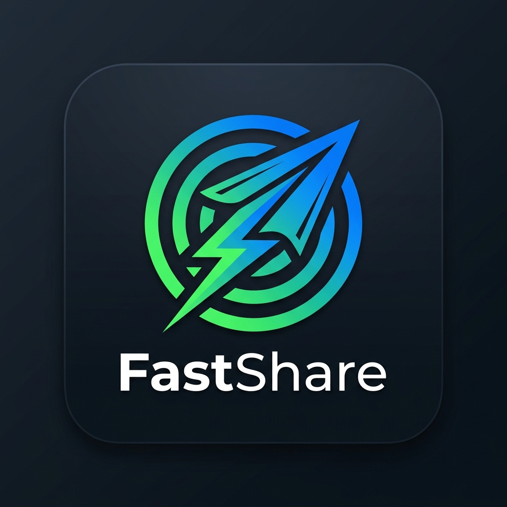
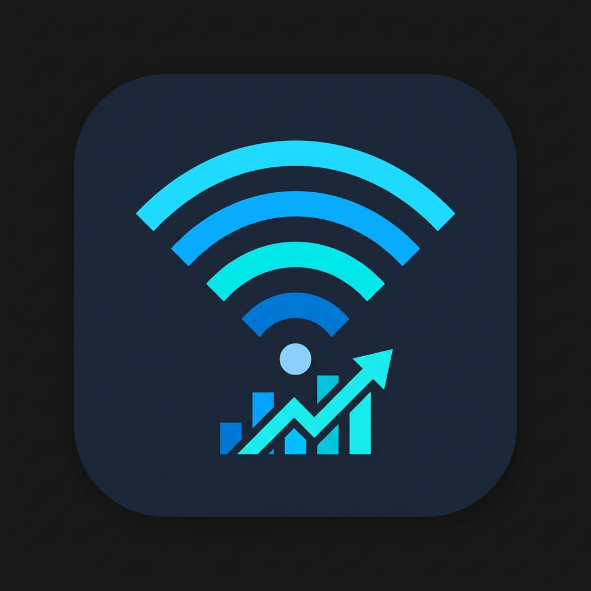

<div align="center">
  

  <a href="https://readme-typing-svg.demolab.com">
    
  </a>
</div>

<div align="center">
  <a href="https://t.me/ritik7094"></a>
  <a href="https://ritikthakur.com.np"></a>
  <a href="mailto:ritikthakur@duck.com"></a>
</div>

<br />

## `> whoami`

```text
ritik@github:~$ I turn engineering ideas into practical applications.
```

- 🎓 Computer Engineering student with a strong foundation in data structures and algorithms.
- 🛠️ Building open-source apps across C#, Android, and the web.
- 🐧 At home in Linux, VPS environments, and operating-system internals.
- 🧠 Exploring applied AI and the systems that make software dependable.
- 🎮 Gamer by passion; problem-solver by default.

## `> stack --active`

<div align="center">
  
  
  
  
  
  
  
  
  
  <br />
  
  
  
  
  
</div>

## `> featured_projects`

<div align="center">
  <table>
    <tr>
      <td align="center">
        <a href="https://github.com/ritikthakur22/com.ritikqrscanner.app">
          
          <br /><b>QR Scanner</b>
        </a>
      </td>
      <td align="center">
        <a href="https://github.com/ritikthakur22/fastshare_app">
          
          <br /><b>FastShare App</b>
        </a>
      </td>
      <td align="center">
        <a href="https://github.com/ritikthakur22/scientific-calcr-pro">
          
          <br /><b>Scientific Calcr</b>
        </a>
      </td>
    </tr>
    <tr>
      <td align="center">
        <a href="https://github.com/ritikthakur22/FastShare">
          
          <br /><b>FastShare Web</b>
        </a>
      </td>
      <td align="center">
        <a href="https://github.com/ritikthakur22/wifi_analyzer_app">
          
          <br /><b>WiFi Analyzer</b>
        </a>
      </td>
    </tr>
  </table>
</div>

## `> github --telemetry`

<div align="center">
  
  
</div>

<div align="center">
  
</div>

## `> contribution_grid --animate`

<div align="center">
  
</div>

<div align="center">
  
  <br /><br />
  <i>"Stay curious. Keep shipping."</i>
  <br /><br />
  
</div>
